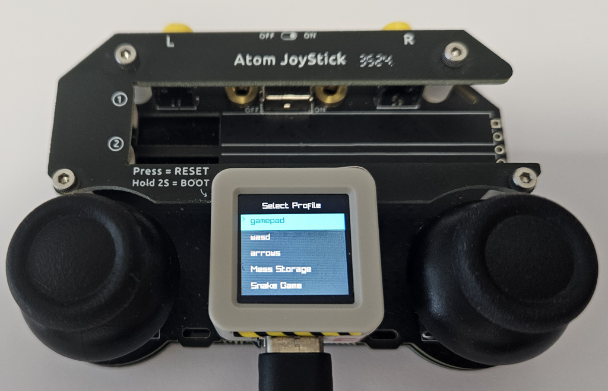
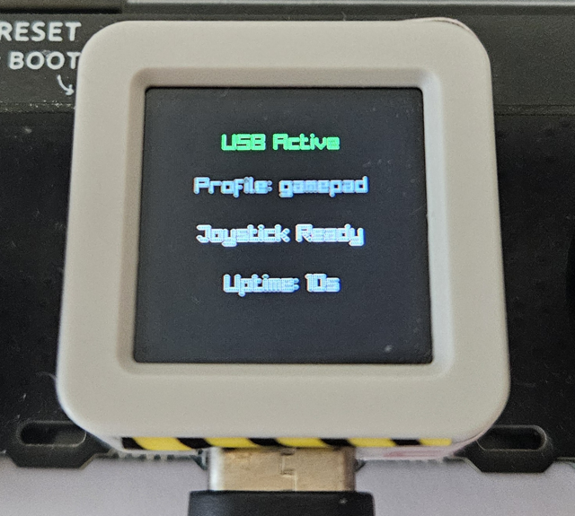
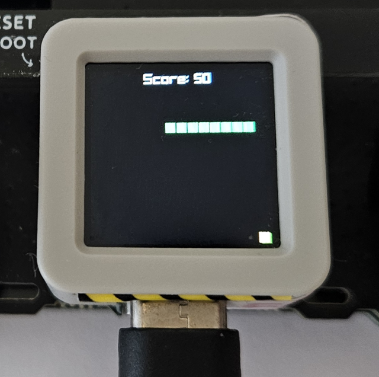

# AtomS3R USB Joystick (ESP32-S3)

A HID game controller and multi-mode peripheral firmware for the
[M5Stack AtomS3R](https://docs.m5stack.com/en/core/AtomS3R) (ESP32-S3) board.
The firmware is built on top of [raylib](https://www.raylib.com/) with its
software renderer driving the on-panel LCD, and exposes the device as a USB HID
controller, a BLE HID controller, an MSC storage device, and a small Snake game.

Device state is chosen through a profile-selection menu rendered on the built-in
display. Each profile is a named configuration that selects which mode the board
enters when it enumerates.

Atom JoyStick board contains high quality hall-effect joysticks suitable for very fine control.
It can be used to control games like [Uncrashed](https://store.steampowered.com/app/1682970/Uncrashed__FPV_Drone_Simulator/).

## Features

- Profile-selection menu rendered on the 128x128 GC9107 display.\
  
- USB HID: gamepad, keyboard, and mouse reports (via libtinyusb).\
  
- (in progress): BLE HID: gamepad, keyboard, and mouse over Bluetooth.
- USB Mass Storage device.
- Snake mini-game selectable from the menu.\
  
- Profiles loaded from on-board storage or a built-in default set.

## Hardware

- [M5Stack AtomS3R](https://docs.m5stack.com/en/core/AtomS3R) - HW rev: 2025.09.19
- [Atom JoyStick](https://docs.m5stack.com/en/app/Atom%20JoyStick) - replace AtomS3 unit with AtomS3R mentioned above (requires PSRAM)

Note: For older version with just with Atom JoyStick, check out repo: https://github.com/georgik/m5stack-atom-joystick-usb

### Display

The module ships with a GC9107 panel (a member of the GC91xx family, register-compatible
with GC9A01). ESP-IDF ships no dedicated GC9107 driver, so we drive it with
`esp_lcd_gc9a01`. 

Note: Current code is for HW rev: 2025.09.19, newer HW rev requirs change to ST7789 (not implemented yet)

| Signal | GPIO |
| --------- | --------- |
| SPI bus | SPI3_HOST |
| MOSI | GPIO21 |
| SCLK | GPIO15 |
| CS | GPIO14 |
| DC | GPIO42 |
| RST | GPIO48 |
| Resolution | 128x128, RGB ordered as BGR |

The panel is reset, initialized, and column-flipped (`MX` bit → MADTL `0x48`) to match
the physical panel orientation, the colour inversion is enabled (`INVON`), and the
backlight is enabled after initialization. Init timing mirrors the reference mipidsi
firmware (a settle delay before and after reset). See `wiki/display.md` for the full
rationale.

### Backlight

The backlight is not a plain GPIO: the white channel is driven by an LP5562
constant-current LED controller on I2C. The driver enables the chip and sets the
white-channel PWM value so the panel lights.

| Signal | GPIO / address |
| --------- | --------- |
| I2C bus | GPIO0 (SCL), GPIO45 (SDA) |
| Device address | 0x30 (7-bit) |

### Input

| Signal | GPIO / address |
| --------- | --------- |
| I2C joystick | 0x59 (I2C, 400 kHz) |
| Joystick SCL | GPIO39 |
| Joystick SDA | GPIO38 |
| Select button | GPIO41 (active low) |

### I2C buses

The AtomS3R uses **two separate I2C peripherals**, each driven by its own driver:

| Bus | I2C port | GPIO | Devices |
| --------- | --------- | --------- | --------- |
| SYS | 0 | GPIO0 (SCL), GPIO45 (SDA) | LP5562 backlight (0x30), BMI270 IMU (0x68) |
| C-Port | 1 | GPIO39 (SCL), GPIO38 (SDA) | StampFly joystick (0x59) |

Each driver pins its bus to a distinct `.i2c_port` (`backlight.c` → port 0,
`i2c_joystick.c` → port 1). ESP-IDF's `i2c_master` driver maps an unset port to
port 0, so if both buses left it unspecified the second `i2c_new_master_bus()`
would fail with *"I2C bus id(0) has already been acquired"*. The ESP32-S3 provides
two I2C peripherals (`SOC_I2C_NUM == 2`), so the two buses never collide.

## Profiles

Profiles are read from storage at startup. If storage is empty or unreadable the
firmware falls back to the built-in default profiles. Each default profile maps to
a mode through its type and connection mode:

| Profile | Type | Connection | Resulting mode |
| --------- | --------- | --------- | --------- |
| gamepad | gamepad | USB | USB HID gamepad |
| wasd | keyboard/mouse | USB | USB HID keyboard + mouse |
| arrows | keyboard | USB | USB HID keyboard |
| Mass Storage | (unknown) | USB | USB Mass Storage |
| Snake Game | (unknown) | auto | Snake game |

The menu scrolls automatically so the selected entry is always visible when the
list is longer than the display. Move the cursor up and down to browse, the
selection is highlighted, and a bright bar follows the list as it scrolls.

## Architecture

- `main/main.c`: entry point, display and peripheral initialization, the
  application state machine (`APP_STATE_MENU`, `APP_STATE_USB_HID`,
  `APP_STATE_BLE_HID`, `APP_STATE_MSC`, `APP_STATE_SNAKE`), and the raylib render
  loop.
- `main/main.c` display section: GC9107 SPI initialization and the raylib flush
  callback, which rebuilds a natural-order framebuffer (undoing raylib's vertical
  flip), byte-swaps RGB565, and draws the full 130x129 framebuffer directly with no
  COG offset. See `wiki/display.md`.
- `main/backlight.c`: LP5562 I2C backlight driver.
- `main/i2c_joystick.c`: I2C joystick input driver.
- `main/gpio_input.c`: GPIO button input sampling.
- `main/profile_menu.c`: Raylib profile-selection menu (rendering, navigation,
  scrolling).
- `main/profile_parser.c`: profile loading and parsing, with the built-in default
  set.
- `main/hid_reports.c`: USB HID report generation.
- `main/ble_hid.c`: BLE HID reporting.
- `main/snake_game.c`: Snake game logic.
- `main/ui.c`: status and USB-active screen rendering helpers.

## Build

The project uses the ESP-IDF build system. Set `IDF_PATH` to your [ESP-IDF v6.1](https://docs.espressif.com/projects/idf-im-ui/en/latest/)
and run from the project directory:

```bash
idf.py set-target esp32s3
idf.py build
```

Tested with ESP-IDF commit: [97d95853572ab74f476959](https://github.com/espressif/esp-idf/commit/97d95853572ab74f476959)

## Flash

Flash to the device with your serial port:

```bash
idf.py flash monitor
```


